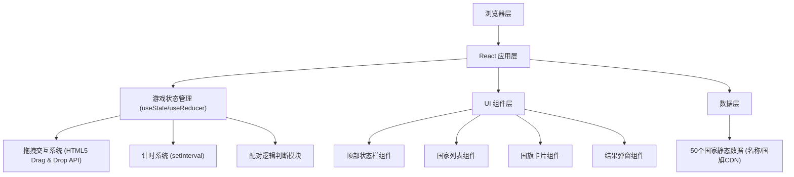

## 1. 架构设计



## 2. 技术描述

- **前端框架**：React@18 + Vite@5
- **样式方案**：TailwindCSS@3.4 + CSS 自定义动画
- **拖拽方案**：原生 HTML5 Drag and Drop API（无需额外库，轻量高效）
- **国旗资源**：使用 flagcdn.com 提供的高质量国旗 SVG 图片（无需本地存储）
- **构建工具**：Vite（快速开发和构建）
- **后端**：无（纯前端单页应用）
- **数据库**：无（所有数据内置在前端代码中）

## 3. 路由定义

| 路由 | 用途 |
|-----|-----|
| / | 游戏主页（唯一页面，单页应用） |

## 4. 数据模型

### 4.1 国家数据结构

```typescript
interface Country {
  code: string;      // ISO 3166-1 alpha-2 国家代码，用于获取国旗
  name: string;      // 国家中文名称
  nameEn: string;    // 国家英文名称（备用）
}
```

### 4.2 游戏状态结构

```typescript
interface GameState {
  selectedCountries: Country[];    // 当前轮次选中的5个国家
  shuffledFlags: Country[];        // 打乱顺序的国旗（用于右侧显示）
  matches: Record<string, string | null>;  // 配对映射: countryCode -> flagCode
  status: 'idle' | 'playing' | 'finished'; // 游戏状态
  startTime: number | null;        // 开始时间戳
  endTime: number | null;          // 结束时间戳
  correctCount: number;            // 正确配对数
  totalAttempts: number;           // 总尝试次数
  wrongFlags: Set<string>;         // 当前错误标记的国旗集合
}
```

### 4.3 50个国家题库

覆盖五大洲的代表性国家：
- 亚洲：中国、日本、韩国、印度、泰国、越南、新加坡、马来西亚、印度尼西亚、菲律宾、土耳其、沙特阿拉伯、伊朗、以色列
- 欧洲：英国、法国、德国、意大利、西班牙、葡萄牙、荷兰、比利时、瑞士、瑞典、挪威、芬兰、丹麦、奥地利、希腊、俄罗斯、波兰、爱尔兰
- 美洲：美国、加拿大、墨西哥、巴西、阿根廷、智利、秘鲁、哥伦比亚、古巴
- 非洲：埃及、南非、尼日利亚、肯尼亚、摩洛哥、埃塞俄比亚
- 大洋洲：澳大利亚、新西兰

## 5. 核心算法

### 5.1 Fisher-Yates 随机打乱算法
```
function shuffle(array):
    for i from array.length - 1 down to 1:
        j = random integer in [0, i]
        swap array[i] and array[j]
    return array
```

### 5.2 随机抽取算法
```
function selectRandom(countries, count):
    shuffled = shuffle([...countries])
    return first 'count' elements of shuffled
```

## 6. 关键模块说明

### 6.1 拖拽交互模块
- 国旗卡片设置为 draggable=true
- 国家名称区域设置为放置目标（ondragover + ondrop）
- 拖拽过程中实时更新视觉状态（半透明、目标区域高亮）

### 6.2 配对判断模块
- 放置时比对国旗代码与目标国家代码
- 正确：更新 matches 状态，correctCount+1，totalAttempts+1，设置绿色边框
- 错误：totalAttempts+1，设置红色边框+摇晃动画，1秒后重置状态

### 6.3 计时模块
- 游戏开始（首次拖拽）时记录 startTime
- 使用 setInterval 每秒更新显示时间（mm:ss）
- 游戏结束时记录 endTime，计算总用时

### 6.4 游戏完成检测
- 每次配对成功后检查 matches 是否填满
- 全部完成时计算正确率 = (correctCount / totalAttempts) * 100%
- 触发结果弹窗显示统计数据
